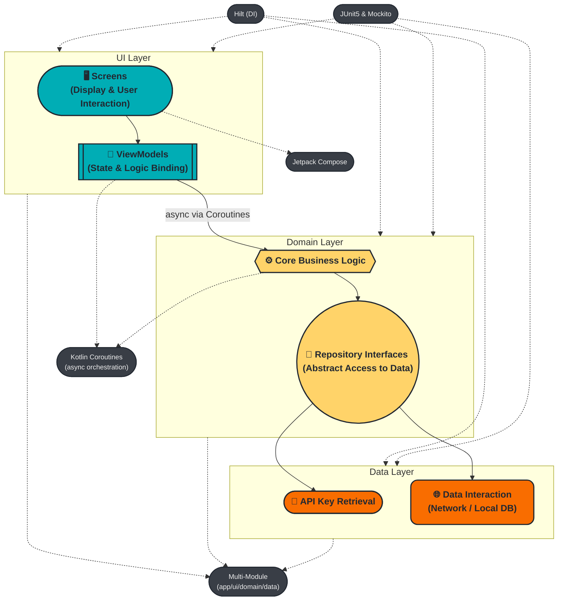

# android-architecture-modular-template

A clean, multi-module boilerplate for building Android apps using modern best practices.

- Kotlin & Coroutines
- Jetpack Compose for UI
- Hilt for Dependency Injection
- Multi-Module Architecture (app, ui, domain, data)
- JUnit 5 & Mockito for Unit Testing

### Resources

* **Dependency Injection with Hilt:** [A Complete Guide to Dependency Injection in Jetpack Compose using Hilt](https://medium.com/@jecky999/dependency-injection-in-jetpack-compose-using-hilt-a-complete-guide-0f7bf802d6cb) by Jecky.

* **Unit Testing with Mockito:** [Mocking with Mockito: Simplifying Unit Testing](https://medium.com/@alxkm/mocking-with-mockito-simplifying-unit-testing-in-java-1cc50d78d2c0) by Alexander K.

* **MVVM & ViewModel Testing:** [A Complete Guide to MVVM and ViewModel Testing in Android (Hilt, JUnit, and Mockito)](https://medium.com/@deepak.patidark93/a-complete-guide-to-mvvm-and-viewmodel-testing-in-android-hilt-junit-and-mockito-explained-df54324b8dca) by Deepak Patidar.

* *Gemini*
